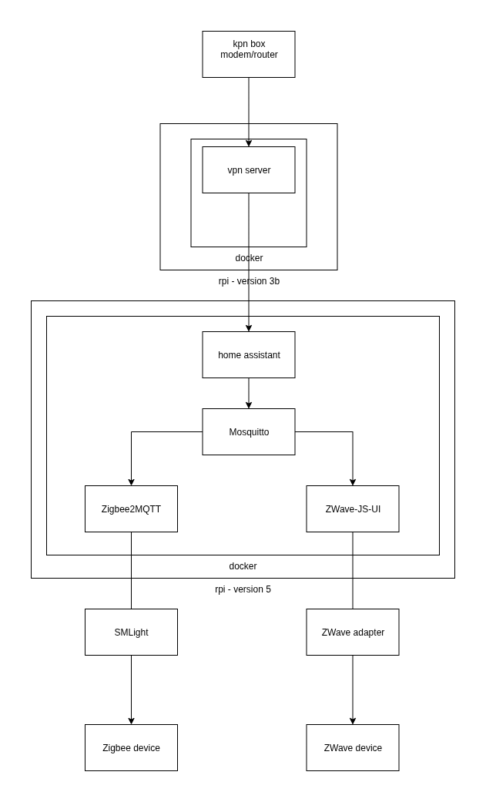
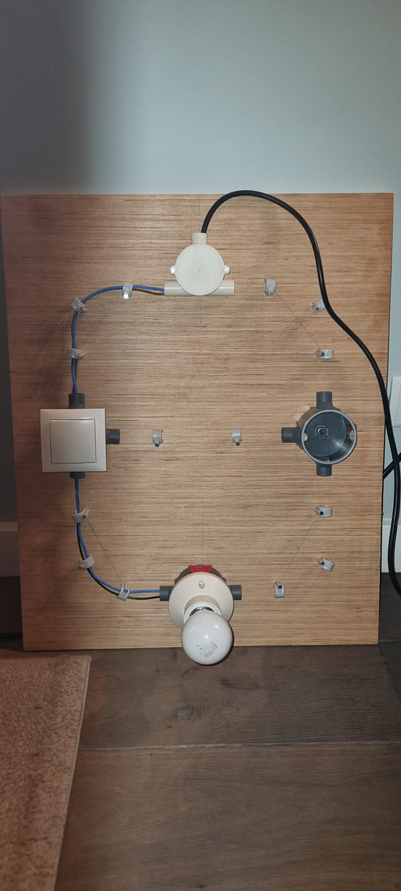

# Home

This repository contains all the code and documentation for my home automation.

Main goals:
- zero emission
- comfort in smart automation

In the diagram you can see my setup

# Test bench

- https://hometechhacker.com/how-to-make-a-smart-home-test-bench/

This is my test bench for home automation. I use it to test new devices and configurations before deploying them in my home.
I am a few days in and it already payed off. 

# Documentation

Look at the Architecture Decision Records (ADR) in the [ADR](./docs/adr) folder for more information about the decisions I made and why.

# Releasing

This project follows a continuous deployment approach. Changes pushed to the main branch are automatically deployed to the `mars` host.

**Before any release, always ensure a backup is performed using the instructions in the [Infrastructure Management README](./infrastructure/mars/ansible/README.md).**

- For configuration changes (e.g., Home Assistant, Zigbee2MQTT settings), refer to the [Infrastructure Management README](./infrastructure/mars/ansible/README.md) for Ansible instructions.
- For Docker-related changes (e.g., updating service versions, modifying `docker-compose.yml`), refer to the [Service Management README](./services/README.md).
