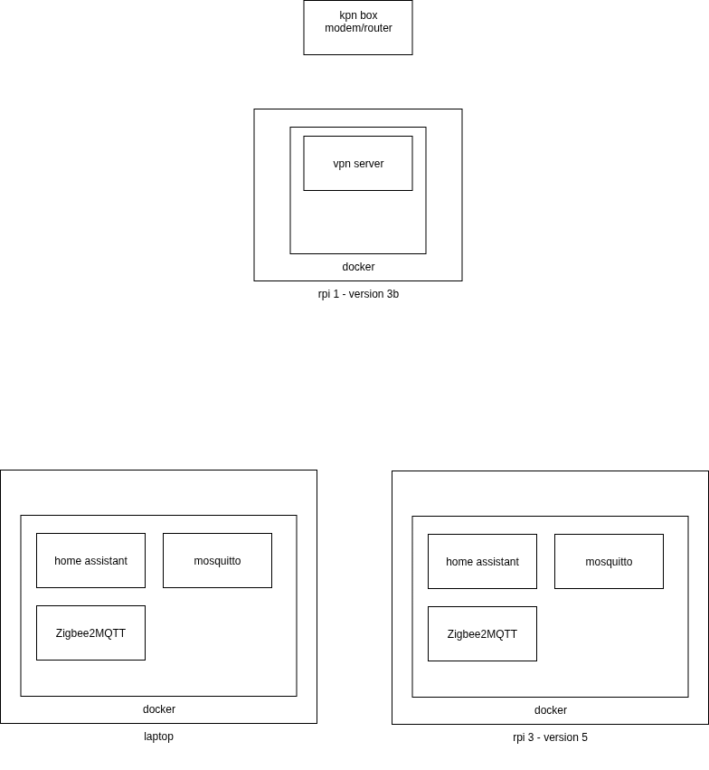

# Home

This repository contains all the code and documentation for my home automation.

Main goals:
- zero emission
- comfort in smart automation

In the diagram you can see my setup

## Approach

### At first
- Start with a production environment only
- Deploy from my own laptop
    
### Later
- Introduce VPN to access the home network from outside
- Introduce a test environment
- Deploy from a CI/CD pipeline with GitHub Actions

# Test bench

- https://hometechhacker.com/how-to-make-a-smart-home-test-bench/

- shelly doc: https://kb.shelly.cloud/knowledge-base/shelly-1pm-mini-gen4#Shelly1PMMiniGen4-Deviceidentification
- https://www.reddit.com/r/ShellyUSA/comments/1eaayq8/shelly_1_mini_g3_how_come_the_toggle_and_edge/