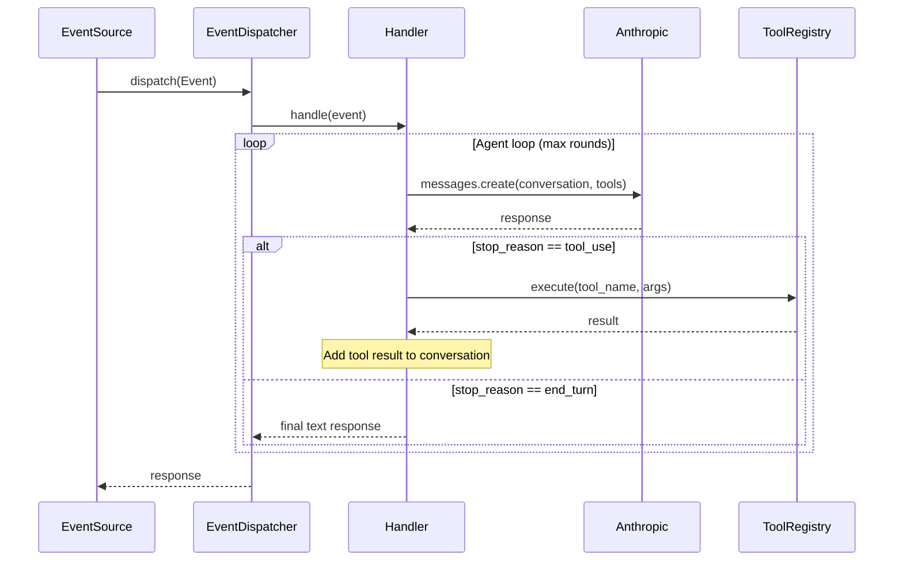

# Event Flow

```mermaid
sequenceDiagram
    participant S as EventSource
    participant D as EventDispatcher
    participant H as Handler
    participant A as Anthropic
    participant T as ToolRegistry

    S->>D: dispatch(Event)
    D->>H: handle(event)

    loop Agent loop (max rounds)
        H->>A: messages.create(conversation, tools)
        A-->>H: response

        alt stop_reason == tool_use
            H->>T: execute(tool_name, args)
            T-->>H: result
            Note over H: Add tool result to conversation
        else stop_reason == end_turn
            H-->>D: final text response
        end
    end

    D-->>S: response
```
