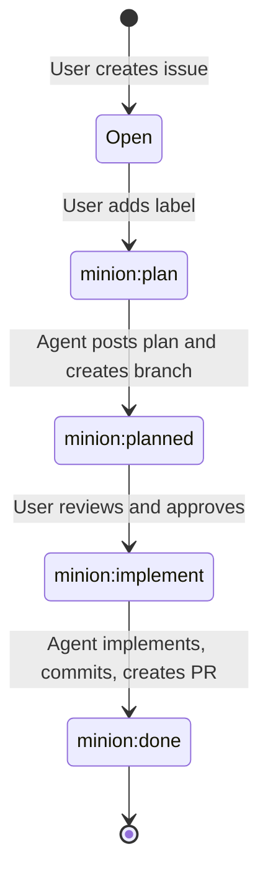

# GitHub Workflow

```mermaid
stateDiagram-v2
    [*] --> Open: User creates issue

    Open --> Planning: User adds label
    Planning --> Planned: Agent posts plan and creates branch
    Planned --> Implementing: User reviews and approves
    Implementing --> Done: Agent implements, commits, creates PR

    Planning: minion#colon;plan
    Planned: minion#colon;planned
    Implementing: minion#colon;implement
    Done: minion#colon;done

    Done --> [*]
```
