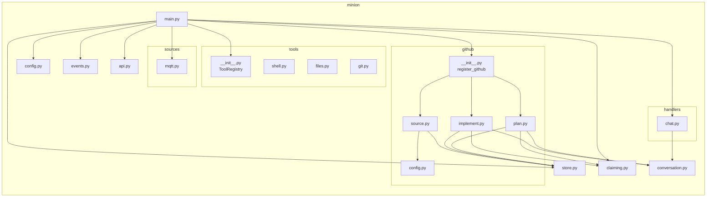

# Package Structure

```mermaid
graph LR
    subgraph minion
        main[main.py]
        config[config.py]
        events[events.py]
        conversation[conversation.py]
        api[api.py]
        store_mod[store.py]
        claiming_mod[claiming.py]

        subgraph handlers
            chat[chat.py]
        end

        subgraph sources
            mqtt[mqtt.py]
        end

        subgraph tools
            tools_init[__init__.py<br/>ToolRegistry]
            shell[shell.py]
            files[files.py]
            git[git.py]
        end

        subgraph github
            gh_init[__init__.py<br/>register_github]
            gh_config[config.py]
            gh_source[source.py]
            gh_plan[plan.py]
            gh_impl[implement.py]
        end
    end

    main --> config
    main --> events
    main --> api
    main --> chat
    main --> mqtt
    main --> gh_init
    main --> tools_init
    main --> store_mod
    main --> claiming_mod

    chat --> conversation
    gh_plan --> conversation
    gh_impl --> conversation

    gh_plan --> store_mod
    gh_impl --> store_mod
    gh_plan --> claiming_mod
    gh_impl --> claiming_mod
    gh_source --> store_mod

    gh_init --> gh_source
    gh_init --> gh_plan
    gh_init --> gh_impl
    gh_source --> gh_config
```
