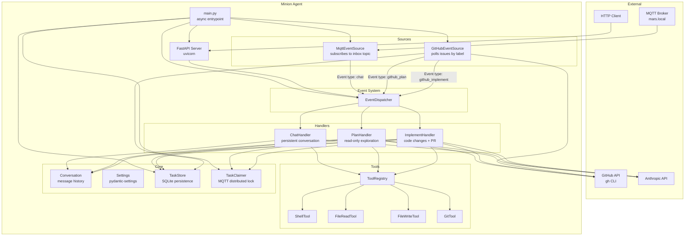

# System Overview

```mermaid
graph TB
    subgraph External
        MQTT[MQTT Broker<br/>mars.local]
        GH[GitHub API<br/>gh CLI]
        API_CLIENT[HTTP Client]
        ANTHROPIC[Anthropic API]
    end

    subgraph Minion Agent
        MAIN[main.py<br/>async entrypoint]

        subgraph Event System
            DISPATCHER[EventDispatcher]
        end

        subgraph Sources
            MQTT_SRC[MqttEventSource<br/>subscribes to inbox topic]
            GH_SRC[GitHubEventSource<br/>polls issues by label]
        end

        subgraph Handlers
            CHAT[ChatHandler<br/>persistent conversation]
            PLAN[PlanHandler<br/>read-only exploration]
            IMPL[ImplementHandler<br/>code changes + PR]
        end

        subgraph Tools
            REGISTRY[ToolRegistry]
            SHELL[ShellTool]
            FILE_R[FileReadTool]
            FILE_W[FileWriteTool]
            GIT[GitTool]
        end

        subgraph Core
            CONV[Conversation<br/>message history]
            CONFIG[Settings<br/>pydantic-settings]
            STORE[TaskStore<br/>SQLite persistence]
            CLAIMER[TaskClaimer<br/>MQTT distributed lock]
        end

        API_SERVER[FastAPI Server<br/>uvicorn]
    end

    MAIN --> DISPATCHER
    MAIN --> MQTT_SRC
    MAIN --> GH_SRC
    MAIN --> API_SERVER
    MAIN --> STORE
    MAIN --> CLAIMER

    MQTT --> MQTT_SRC
    API_CLIENT --> API_SERVER
    API_SERVER --> DISPATCHER

    MQTT_SRC -->|Event type: chat| DISPATCHER
    GH_SRC -->|Event type: github_plan| DISPATCHER
    GH_SRC -->|Event type: github_implement| DISPATCHER

    DISPATCHER --> CHAT
    DISPATCHER --> PLAN
    DISPATCHER --> IMPL

    CHAT --> CONV
    PLAN --> CONV
    IMPL --> CONV

    CHAT --> ANTHROPIC
    PLAN --> ANTHROPIC
    IMPL --> ANTHROPIC

    CHAT --> REGISTRY
    PLAN --> REGISTRY
    IMPL --> REGISTRY

    PLAN --> STORE
    IMPL --> STORE
    PLAN --> CLAIMER
    IMPL --> CLAIMER
    GH_SRC --> STORE

    REGISTRY --> SHELL
    REGISTRY --> FILE_R
    REGISTRY --> FILE_W
    REGISTRY --> GIT

    PLAN --> GH
    IMPL --> GH
    GH_SRC --> GH
```
