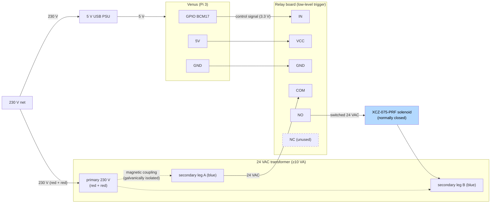

# irrigation-tap-bridge

Ansible role that installs the **Phase 1 garden-irrigation tap bridge** on Venus
as a systemd service. The bridge is a small Python program that subscribes to an
MQTT command topic and drives one GPIO pin (relay → 24 VAC → Rain Bird XCZ
solenoid). Home Assistant on Mars holds all watering policy and just publishes
`ON`/`OFF`; the valve is a dumb on/off switch.

Full plan and rationale: **GitHub issue #4**.

## What it deploys

| Path on Venus | Purpose |
|---|---|
| `/opt/smartworkx/irrigation-tap/irrigation_tap_bridge.py` | the bridge |
| `/etc/systemd/system/irrigation-tap-bridge.service` | systemd unit (auto-restart, env config) |

apt deps: `python3-paho-mqtt`, `python3-lgpio`.

## MQTT contract (Mars Mosquitto, anonymous, :1883)

| Topic | Direction | Payload |
|---|---|---|
| `irrigation/tap/set` | HA → bridge | `ON` / `OFF` |
| `irrigation/tap/state` | bridge → HA | `ON` / `OFF` (retained) |
| `irrigation/tap/availability` | bridge → HA | `online` / `offline` (LWT, retained) |

## Safety (fail-safe closed)

The valve is closed at startup, on `SIGTERM`/`SIGINT`, on MQTT disconnect (the
bridge can no longer receive an `OFF`), and automatically after
`MAX_ON_SECONDS` (watchdog). The watchdog is the backstop, not the only line of
defence: if HA dies mid-run, the watchdog still closes the tap.

The wired board is the common blue 4-channel JQC-3FF opto board, which is
**low-level trigger** (relay energises when IN is LOW) — hence
`irrigation_tap_active_high: false`. That would normally be the fail-unsafe
choice, so it was verified empirically (2026-06-10): with the bridge disabled
and the pin undriven through a full Venus boot, the channel LED only glows
faintly (BCM17's ~50 kΩ pull-down leaks ~0.07 mA, far below the ~5–10 mA the
opto needs) and the relay's NO contact stays open (measured OL on a Fluke).
A faint LED glow while the pin is undriven is therefore normal and harmless.
Re-verify this if the board, the GPIO pin, or the Pi model ever changes.

## Hardware & wiring

Field side is deliberately simple — one relay switching 24 VAC to a
normally-closed solenoid. Left half is the low-voltage control side, right
half is the switched 24 VAC loop:



- **Use the relay's NO (normally-open) contact** so the solenoid is powered
  only when the relay is actively closed. On these 3-screw terminal blocks the
  **middle screw is COM**; identify NO with a continuity meter — the outer
  screw that reads **OL while the relay is at rest** is NO (the one that beeps
  is NC).
- The board is **low-level trigger** (see *Safety* above for why that is
  acceptable here): the bridge runs with `ACTIVE_HIGH=false` and drives the
  pin LOW to open the valve.
- **24 VAC** sprinkler transformer (≥ 10 VA) for the solenoid. It's AC, so no
  flyback diode; an RC snubber across the contact is optional.
- The Rain Bird XCZ-075-PRF is **normally-closed**: no power = shut = fail-safe.
  Its built-in pressure-regulating filter (~40 psi) is electrically irrelevant.
- Most opto-isolated relay boards accept the Pi's 3.3 V on `IN` (some need the
  `JD-VCC` jumper moved); board VCC is 5 V.
- The wired pin is `irrigation_tap_gpio_pin` (default BCM 17).

## Variables (`defaults/main.yml`)

| Variable | Default | Notes |
|---|---|---|
| `irrigation_tap_mqtt_host` | `mars` | broker (mDNS `mars.local` does not resolve from Venus) |
| `irrigation_tap_mqtt_port` | `1883` | |
| `irrigation_tap_topic_base` | `irrigation/tap` | topic prefix |
| `irrigation_tap_gpio_backend` | `real` | `real` = lgpio; `stub` = log only (dry run) |
| `irrigation_tap_gpio_chip` | `0` | `/dev/gpiochip0` on a Pi 3 |
| `irrigation_tap_gpio_pin` | `17` | BCM pin to the relay IN |
| `irrigation_tap_active_high` | `false` | the blue JQC-3FF opto board is low-level trigger (fail-safe verified, see *Safety*) |
| `irrigation_tap_max_on_seconds` | `2400` | watchdog; must exceed the longest HA run (Phase 1 max 30 min) |

## Deploy

```bash
cd infrastructure/venus/ansible/
ansible-playbook -i inventory.ini irrigation-tap-playbook.yml

# Dry run with no relay wired (logs valve open/close, touches no GPIO):
ansible-playbook -i inventory.ini irrigation-tap-playbook.yml \
  -e irrigation_tap_gpio_backend=stub

# Pick the wired pin:
ansible-playbook -i inventory.ini irrigation-tap-playbook.yml \
  -e irrigation_tap_gpio_pin=27
```

Check / follow logs on Venus:

```bash
systemctl status irrigation-tap-bridge
journalctl -u irrigation-tap-bridge -f
```

## Local development (no hardware, no deploy)

The `stub` backend touches no GPIO, so the whole MQTT/watchdog/fail-safe logic
runs on a laptop against the real broker:

```bash
GPIO_BACKEND=stub MQTT_HOST=mars.local \
  python3 files/irrigation_tap_bridge.py

# another terminal:
mosquitto_sub -h mars.local -t 'irrigation/#' -v
mosquitto_pub -h mars.local -t irrigation/tap/set -m ON
mosquitto_pub -h mars.local -t irrigation/tap/set -m OFF
```

Only the final relay/valve bring-up has to happen on Venus (`GPIO_BACKEND=real`);
the bridge/HA config is identical when you swap the breadboard bulb for the
solenoid.

## Bring-up (breadboard → valve)

Validate in increasing order of consequence. The software is identical at every
step (same pin, same `ACTIVE_HIGH`, same topics) — only the wired load changes:

1. **Stub on the laptop** — see *Local development* above. Proves MQTT /
   watchdog / fail-safe with no hardware.
2. **Bare LED on Venus** — deploy with `GPIO_BACKEND=real` and an LED + resistor
   on the pin. `mosquitto_pub … ON/OFF` drives it. Leave it ON past
   `MAX_ON_SECONDS` → the watchdog turns it off
   (`journalctl -u irrigation-tap-bridge`).
3. **Relay** — wire the relay; repeat the tests, now you hear the click and the
   channel LED follows the switch. **Fail-safe check**: disable the bridge
   (`systemctl disable --now irrigation-tap-bridge`), reboot Venus, and verify
   the relay never clicks and COM↔NO stays open (OL on a continuity meter; a
   faintly glowing channel LED is fine). Re-enable afterwards.
4. **Solenoid** — swap the bulb for the 24 VAC transformer + XCZ valve. Put a
   bucket under a dripper; confirm water flows on `ON` and stops on `OFF`.

## Scaling to more zones (Phase 2+)

The Pi has GPIO to spare — one pin per relay channel, so the existing 4-channel
board covers 4 zones and an 8-channel board covers 8. The constraints are
elsewhere:

- **Pin choice is safety-critical on this low-level-trigger board.** BCM 0–8
  default to *pull-up* at boot, which would energise the relay (valve open)
  until the bridge claims the pin. Only use pins that default to pull-down:
  BCM 17, 27, 22, 23, 24, 25, 5, 6, 12, 13, 16, 26. Re-run the fail-safe
  reboot test (bring-up step 3) once with all channels wired.
- **5 V budget**: each relay coil draws ~70 mA when energised; 8 coils ≈ 0.6 A
  on top of the Pi. Fine with a 2.5–3 A PSU, or feed `JD-VCC` from its own 5 V
  supply (remove the jumper) to take the coils off the Pi's rail.
- **The 10 W transformer fits exactly one solenoid.** A Rain Bird solenoid
  holds at ~0.23 A / ~5.5 VA (inrush ~10 VA), so two open at once ≈ 11 VA =
  110 % continuous — it will run hot in a closed enclosure, and the voltage
  sag risks audible relay/solenoid chatter. **Run zones sequentially** (which
  the irrigation plan does anyway, and which drip lines prefer hydraulically)
  and the current transformer is fine. For parallel zones, fit a proper
  24 VAC **30–50 VA** sprinkler transformer (~€20).
- **The bridge is deliberately single-pin/single-topic.** Multi-zone means
  extending it to `irrigation/zone<n>/{set,state,availability}` with a
  pin map — the per-valve MQTT contract and everything above it (HA,
  Irrigation Unlimited later) stays unchanged.

## Home Assistant side (Mars)

The HA half lives in `services/home-assistant/config/`:

- `packages/irrigation.yaml` — MQTT `switch.irrigation_tap`, enable / duration /
  rain-threshold helpers, two Buienradar REST rain sensors (today / tomorrow),
  Signal notify.
- `custom_automations/irrigation.yaml` — 04:00 run (offline-guard → rain-skip →
  open N min → close) + a bridge-offline alert.

Setup:

1. Add to Mars `secrets.yaml` (gitignored): `signal_sender_number` and
   `signal_recipient_number`.
2. Deploy:
   ```bash
   cd infrastructure/mars/ansible/
   ansible-playbook -i inventory.ini backup_remote_data.yml
   ansible-playbook -i inventory.ini copy-config.yml
   ```
   then restart Home Assistant.
3. Turn on `input_boolean.irrigation_enabled`; set `irrigation_run_minutes` and
   `irrigation_rain_skip_mm`.
4. *(Optional)* Add the **Buienradar** integration in the HA UI for a weather
   card — the REST sensors already drive the watering decision.

## End-to-end smoke tests

1. **Manual** — toggle `switch.irrigation_tap` in HA → valve opens/closes and
   `irrigation/tap/state` follows.
2. **Rain skip** — set `irrigation_rain_skip_mm` to 0 and run the automation
   (or wait for 04:00) → Signal "overgeslagen", no run.
3. **Watchdog** — open the valve and walk away; after `MAX_ON_SECONDS` the
   bridge closes it.
4. **Offline alert** — `systemctl stop irrigation-tap-bridge` → after 5 min HA
   sends the bridge-offline Signal alert and `switch.irrigation_tap` shows
   unavailable.

## Maintenance

- Pre-winter: disable `input_boolean.irrigation_enabled`, drain the line, and
  keep the transformer/relay enclosure out of frost.

## Tests

No broker or GPIO needed — the MQTT client is faked and lgpio is monkeypatched:

```bash
pytest tests/        # from this role dir, or pass the full path from the repo root
```

Covers command handling, the watchdog (armed/cancelled/fires/disabled), the
disconnect fail-safe, and the active-high/-low GPIO level mapping.

## paho-mqtt version note

The bridge uses the **v1 callback API** because Venus (Ubuntu 24.04) ships
`python3-paho-mqtt` 1.6, which only has v1. On paho ≥ 2.0 (e.g. a dev laptop) it
selects `CallbackAPIVersion.VERSION1` and you'll see a harmless deprecation
warning. Both work.
