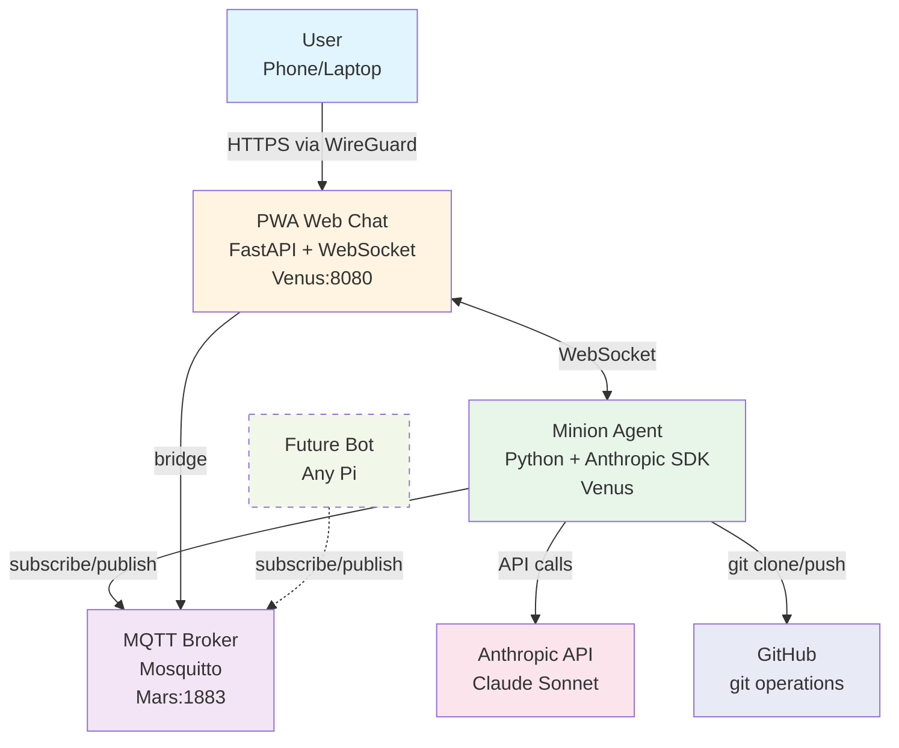

# Session Summary: 2026-02-12 - Autonomous AI Agent Design

## Overview

This session focused on designing an autonomous AI agent system following the docs-as-code approach. The agent, named "Minion", will assist with software development tasks and is designed to run on existing Raspberry Pi hardware. Documentation artifacts are the primary deliverable - no code was written.

## Decisions Made

### 1. Agent Architecture

**Decision**: Lightweight Python agent using direct Anthropic API with tool use

**Key points:**
- **Name**: "Minion" (codename for the agent)
- **Runtime**: Python with Anthropic SDK
- **Hosting**: Venus (Raspberry Pi 3, 1GB RAM) for V1
- **Cost**: ~$3-15/month API usage (moderate daily use)
- **Deployment**: Same `apps/minion` codebase reusable across any Pi
- **Identity**: Per-instance config (e.g., `AGENT_NAME=venus`)

**Rationale:**
- Direct API calls provide full control over tool implementation
- No local model needed - works on 1GB RAM
- Python rich with libraries for git, files, shell
- Agent SDK discarded as too opaque

**ADR**: `docs/adr/0011-autonomous-ai-agent.md`

### 2. Communication Approach

**Decision**: PWA web chat + MQTT backbone

**Components:**
- **User interface**: Progressive Web App served by FastAPI
- **Access**: Via WireGuard VPN (`https://venus.home:8080`)
- **Message bus**: MQTT (existing Mosquitto on Mars)
- **Future**: Multi-agent group chat via MQTT topics

**Rationale:**
- No third-party services (Signal, Telegram rejected)
- Works on any browser (phone, laptop)
- Zero new infrastructure (uses existing MQTT + WireGuard)
- Privacy-focused and self-hosted

**Trade-offs:**
- No push notifications (must check actively)
- Requires VPN connection

**ADR**: `docs/adr/0012-agent-communication.md`

### 3. Naming and Structure

**Code locations:**
- `apps/minion/` - Agent Python application
- `apps/webchat/` - PWA web chat interface
- `services/minion/` - Docker deployment config (follows existing pattern)

**Agent naming:**
- Each instance identified by `AGENT_NAME` env var
- V1 instance: `venus` (runs on Venus Pi)
- Future instances: `jupiter`, `mars`, etc. (same codebase, different config)

### 4. Hardware Assignment

**V1 deployment target**: Venus (Raspberry Pi 3, 1GB RAM)

**Rationale:**
- Available and underutilized
- Sufficient for API-based agent (no local model)
- Existing WireGuard access via Saturn
- Existing MQTT broker on Mars

**Discarded alternative**: Jupiter (more powerful but wanted for other services)

## Architecture

### C4 Container Diagram

### Communication Flow

1. **User → Agent**:
   - User opens PWA at `https://venus.home:8080` (via WireGuard)
   - Types message in web interface
   - PWA sends via WebSocket to FastAPI
   - FastAPI publishes to MQTT topic `minion/chat/user`
   - Agent receives message from MQTT subscription

2. **Agent → User**:
   - Agent processes request (calls Anthropic API, executes tools)
   - Publishes response to MQTT topic `minion/chat/agent`
   - FastAPI receives from MQTT subscription
   - FastAPI forwards via WebSocket to PWA
   - User sees response in web interface

3. **Future multi-agent**:
   - Multiple Minion instances subscribe to same MQTT topics
   - Bots coordinate via `minion/chat/system` topic
   - Group chat enabled by MQTT pub/sub pattern

## Tech Stack Rationale

| Component | Choice | Why |
|-----------|--------|-----|
| **Agent runtime** | Python | Rich ecosystem, Anthropic SDK, standard for AI tools |
| **AI model** | Claude Sonnet (Anthropic API) | High capability, good cost/performance, tool use support |
| **API approach** | Direct API + tool use | Full control, transparency, no SDK black box |
| **Web framework** | FastAPI | Modern, async, WebSocket support, lightweight |
| **Frontend** | PWA (vanilla JS or React) | Browser-based, installable, offline capable |
| **Message bus** | MQTT | Existing infrastructure, pub/sub for multi-agent |
| **VPN** | WireGuard | Already deployed, secure remote access |
| **Deployment** | Docker + Ansible | Consistent with existing service pattern |

## Discarded Alternatives

### Agent SDK
- **Why considered**: Official Anthropic framework for agents
- **Why rejected**: Too opaque, limited control over tool execution, harder to debug

### Signal / Telegram
- **Why considered**: Popular messaging platforms
- **Why rejected**:
  - Signal: Requires second SIM card
  - Telegram: Russian-owned, privacy concerns
  - Both: Third-party dependency conflicts with self-hosted principle

### Local LLM
- **Why considered**: Fully offline, no API costs
- **Why rejected**: Requires more RAM than Pi 3 provides (1GB), lower quality responses

### Jupiter as host
- **Why considered**: More powerful hardware
- **Why rejected**: Venus is available and sufficient, want to reserve Jupiter for other services

## Documentation Artifacts Created

Following docs-as-code principles, the following artifacts were created:

| File | Type | Purpose |
|------|------|---------|
| `docs/adr/0011-autonomous-ai-agent.md` | ADR | Agent architecture decision |
| `docs/adr/0012-agent-communication.md` | ADR | Communication approach decision |
| `sessions/2026-02-12-autonomous-ai-agent-design.md` | Session report | This document |

## Next Steps

The documentation artifacts serve as the specification for implementation:

1. **GitHub Issue #2**: Update with references to ADRs and acceptance criteria
2. **Implementation phase** (future session):
   - Create `apps/minion/` Python application
   - Implement tool execution layer (git, file ops, shell)
   - Create `apps/webchat/` PWA interface
   - Setup MQTT communication
   - Docker deployment configuration
   - Ansible playbook for Venus deployment

3. **Future enhancements** (post-V1):
   - Push notifications via PWA APIs
   - Multi-agent coordination patterns
   - Enhanced tool library
   - Monitoring and logging
   - Cost tracking and alerts

## Key Insights

1. **Docs-as-code works**: Writing ADRs first forced clear thinking about architecture trade-offs
2. **Reusability matters**: Same codebase deployable to any Pi via config is more maintainable than per-host customization
3. **Use existing infrastructure**: MQTT, WireGuard, and Docker patterns already proven in this project
4. **Privacy-first**: Rejecting third-party messaging aligns with project principles
5. **Start simple**: Direct API + tool use is simpler than frameworks for V1

## Lessons Learned

1. **ADRs clarify trade-offs**: Writing consequences explicitly helps evaluate decisions
2. **C4 diagrams communicate**: Container diagram makes architecture immediately clear
3. **Session reports preserve context**: Future sessions can reference this design rationale
4. **Docs before code prevents rework**: Alignment on approach before implementation saves time
